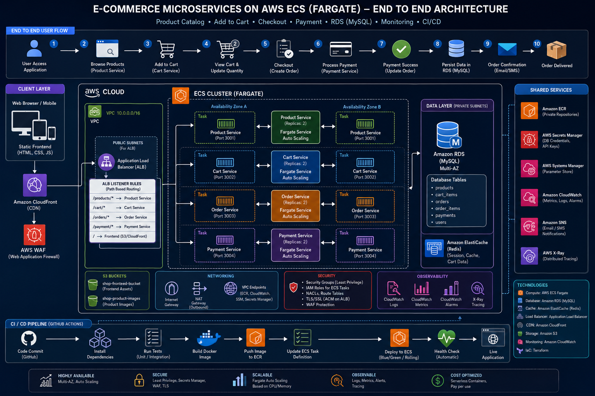

# 🛍️ Shop Easy — E-Commerce Microservices

> Lightweight microservices e-commerce app on AWS ECS Fargate. 1-click deploy via GitHub Actions.

---

## Architecture



### End-to-End Flow

```
Developer → git push → GitHub Actions → Build Docker → Push ECR → Deploy ECS
                                                                        ↓
User → Browser → ALB (port 80) → path-based routing:
                                    /products*  → Product Service (ECS)
                                    /cart*      → Product Service (ECS)
                                    /orders*    → Order Service (ECS)
                                    /payments*  → Order Service (ECS)
                                    /*          → Frontend (ECS/Nginx)
                                                        ↓
                                    All services → MySQL RDS
```

---

## Services (3 Fargate Tasks)

| Service | Port | Handles | Tech |
|---------|------|---------|------|
| Frontend | 80 | UI — browse, cart, checkout | React + Nginx |
| Product Service | 4001 | Products + Cart | Node.js/Express |
| Order Service | 4002 | Orders + Payments | Node.js/Express |

---

## 1-Click Deploy to AWS

### Prerequisites
- AWS account with `AdministratorAccess` IAM user
- GitHub repo forked/cloned

### Setup (once)

Add **3 secrets** to your GitHub repo → Settings → Secrets → Actions:

| Secret | Value |
|--------|-------|
| `AWS_ACCESS_KEY_ID` | Your IAM access key |
| `AWS_SECRET_ACCESS_KEY` | Your IAM secret key |
| `DB_PASSWORD` | Any strong password (e.g. `MyPass#2024`) |

### Deploy

1. Go to **Actions** → **🚀 Deploy Shop Easy**
2. Click **Run workflow** → select `deploy`
3. Wait ~15 min → get ALB URL in the summary ✅

### Destroy

Same workflow → select `destroy` → all resources deleted.

---

## Run Locally

```bash
docker compose up --build
```

Open http://localhost:3000

---

## Tech Stack

| Layer | Technology |
|-------|-----------|
| Frontend | React 18, Nginx |
| Backend | Node.js, Express |
| Database | MySQL 8.0 (RDS) |
| Containers | Docker, ECS Fargate |
| Networking | VPC, ALB |
| Registry | Amazon ECR |
| IaC | Terraform |
| CI/CD | GitHub Actions |

---

## Project Structure

```
shop-easy/
├── frontend/           # React SPA + Nginx
├── product-service/    # Products + Cart API
├── order-service/      # Orders + Payments API
├── db-init/            # DB migration container (runs once)
├── database/           # SQL schema + seed data
├── terraform/          # AWS infra (VPC, ECS, RDS, ALB)
├── .github/workflows/  # 1-click CI/CD pipeline
├── docs/               # Architecture diagrams
├── docker-compose.yml  # Local development
└── DEPLOYMENT.md       # Manual deployment guide
```

---

## User Flow

1. **Browse Products** — View products with images, prices, categories
2. **Add to Cart** — Click "Add to Cart", badge updates
3. **View Cart** — See items, quantities, total
4. **Checkout** — Creates order, deducts stock, clears cart
5. **Payment** — Processes payment, marks order "paid"
6. **Orders** — View past orders with status

---

## Cost (~$57/month)

| Resource | Cost |
|----------|------|
| ECS Fargate (3 tasks) | ~$25 |
| RDS db.t3.micro | ~$15 |
| ALB | ~$16 |
| ECR | ~$1 |
| **Total** | **~$57/month** |

> No NAT Gateway = saves $32/month vs typical setups.
